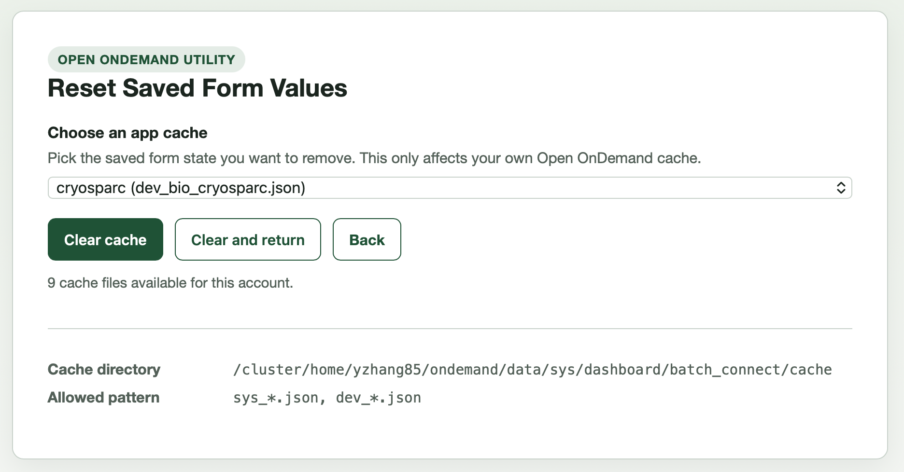

# Cache Reset for Open OnDemand


`Cache Reset` is a small Passenger app for [Open OnDemand](https://openondemand.org/) that lets a user remove saved Batch Connect form state from their own home directory.

It helps users clear stale saved form values without manually deleting cache files.

## Overview

Open OnDemand stores saved Batch Connect form values under:

```text
~/ondemand/data/sys/dashboard/batch_connect/cache/
```

When those cached values no longer match the current app form, users can run into confusing behavior such as:

- forms reopening with outdated defaults
- hidden fields retaining old values
- app submissions failing because saved parameters no longer match current expectations

This app presents the current user's eligible cache files and deletes exactly one selected file at a time.

## Features

- Lists only cache files from the authenticated user's Open OnDemand cache directory
- Limits deletion to filenames matching `sys_*.json` or `dev_*.json`
- Supports a direct "clear and return" flow back to the Open OnDemand dashboard
- Ships as a minimal Rack/Sinatra Passenger app with no JavaScript dependency

## Interface Preview

{width=60%

## Repository Layout

```text
.
├── app.rb
├── config.ru
├── manifest.yml
├── docs/
├── icon.png
├── LICENSE
└── README.md
```

## Installation

1. Copy or clone this repository into an Open OnDemand app directory, for example:

   ```text
   /var/www/ood/apps/sys/cache_reset
   ```

2. Ensure the app files are readable by the web server and that Open OnDemand launches the app as the logged-in user.

3. Confirm the site Ruby environment already provides the required gems, especially Sinatra.

4. Refresh the Open OnDemand app list or restart Passenger as required by your site.

## Configuration

The app works without additional configuration, but the following environment variables are supported:

- `OOD_RETURN_URL`
  Default return target after a successful clear-and-return action.
  Default: `/pun/sys/dashboard`

### Expected Cache Location

The app currently targets the standard Open OnDemand per-user cache path:

```text
~/ondemand/data/sys/dashboard/batch_connect/cache/
```

If your site stores Batch Connect form cache elsewhere, `app.rb` will need to be adjusted before deployment.

## Usage

1. Open the app from the Open OnDemand dashboard.
2. Select the saved cache entry you want to remove.
3. Click `Clear cache` to stay on the utility page, or `Clear and return` to go back to the dashboard.

Only one cache file is deleted per request. The app never accepts an arbitrary path from the user.

## Security Considerations

- The app only inspects the current user's home directory.
- File deletion is restricted to a fixed directory and a strict filename pattern.
- The selected filename must also exist in the app's current whitelist of discovered files.
- Return URLs are limited to Open OnDemand paths beginning with `/pun/`.

This app is intentionally narrow in scope. It is not a general file browser or cache management interface.

## Contributor


Yucheng Zhang  
Research Technology, Tufts Technology Services  
Tufts University  
yucheng.zhang@tufts.edu

## License

See [LICENSE](LICENSE).
